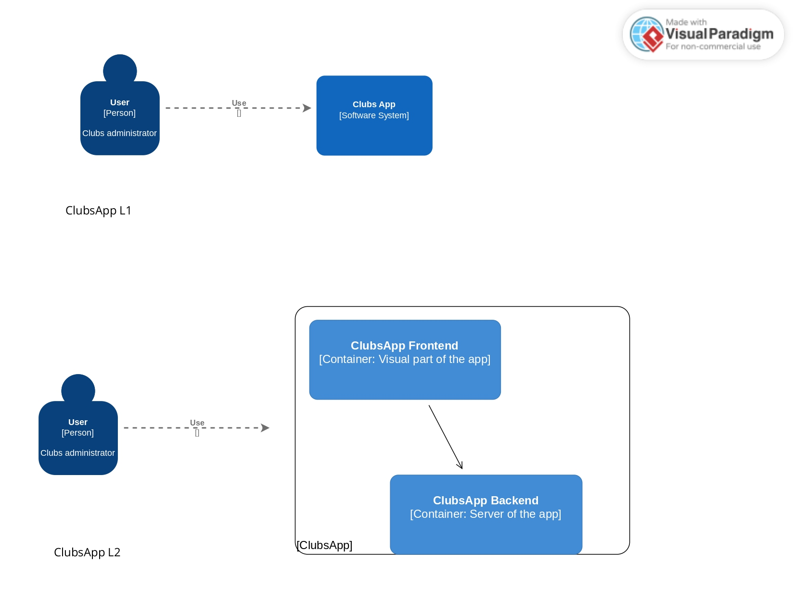
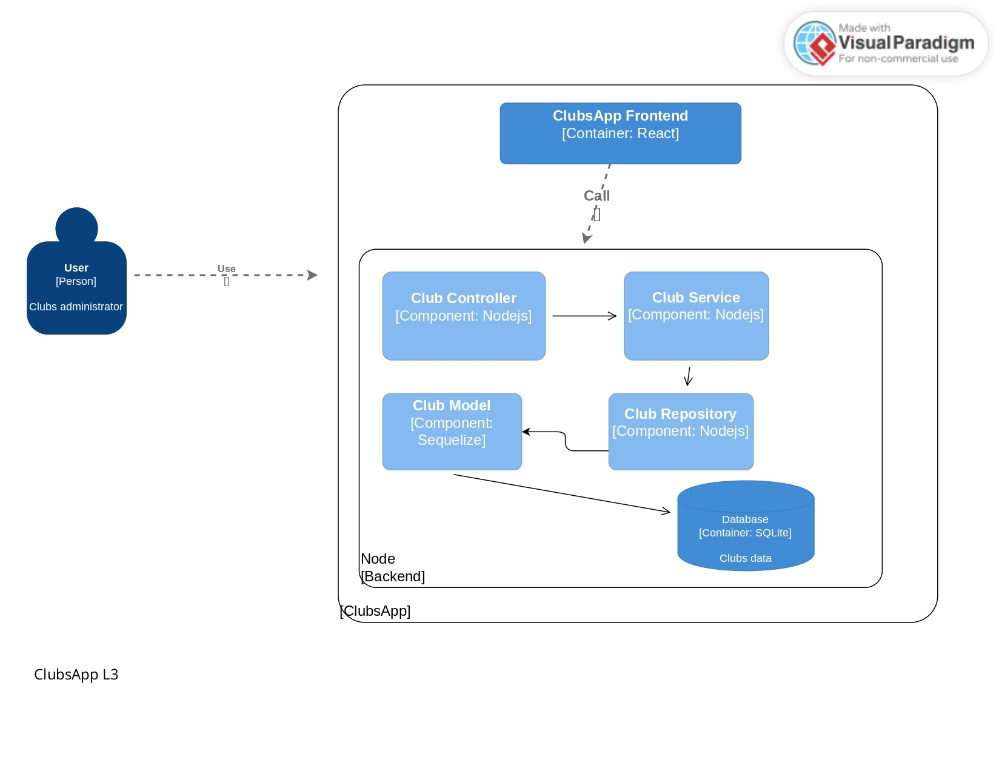
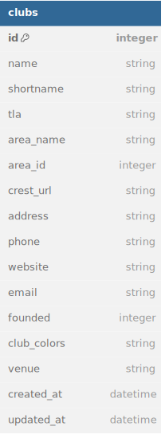

# Clubs App
https://crudteams-react.vercel.app/

C4 Diagrams. Levels 1, 2 and 3.





Database diagram



Project that displays clubs with the ability to delete, update and create clubs.
Made with React and Node, using Sqlite as database management.

Frontend tested with testing-library and backend with jest.

First all: create google api key in: https://console.cloud.google.com/apis/

## Installation

1. Clone this reposity in your local machine: 
    
```
git clone https://github.com/nahuelc00/crudteams-react.git
```

2. Enter in the backend folder and run:

```
npm install
npm run dev
```  

3. In other tab or terminal, enter in the frontend folder and run:

```
npm install
VITE_GOOGLE_MAPS_KEY=YOUR_KEY npm run dev
```  

## Frontend testing

1. Enter in the frontend folder and run : 
 ```
npm run test
```  

## Backend testing

2. Enter in the backend folder and run : 
 ```
npm run test
```  

